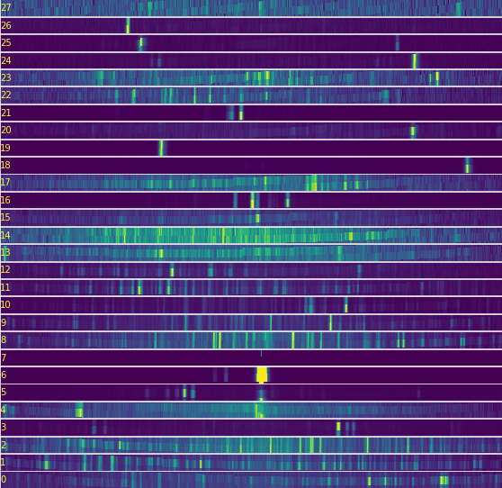
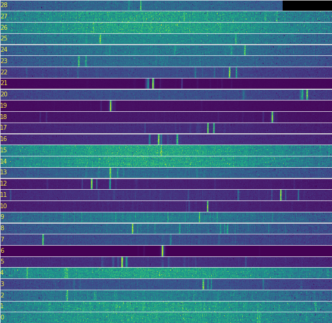

# GUI for Echelle image processing
To convert Echelle images to spectra two options are avaliable: use this GUI, or import `EchelleImage` class to read, calibrate, and produce a `Spectrum` class, from wicht data could be exported. See examples for [CCD](./examples/testtool-CCD.ipynb) and [CMOS](./examples/testtool-CMOS.ipynb) sensors.
| CCD image                           | CMOS image                           |
| --------------------------------    | --------------------------------     |
|  |  |

 