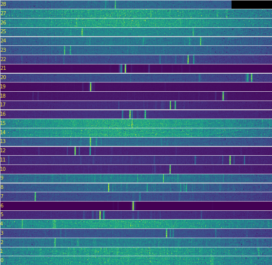

<h1 align="center">
     
    
    Echelle Spectra
     
</h1>

<h4 align="center">Graphical tool for the extraction and analysis of calibrated spectra from 2D Echelle spectrometer images</h4>

  
  
  
  
  
  
  
  
  

# GUI for Echelle image processing
To convert Echelle images to spectra two options are avaliable: use this GUI, or import `EchelleImage` class to read, calibrate, and produce a `Spectrum` class, from wicht data could be exported. See examples for [CCD](src/echelle_spectra/examples/testtool-CCD.ipynb) and [CMOS](src/echelle_spectra/examples/testtool-CMOS.ipynb) sensors.
| CCD image                           | CMOS image                           |
| --------------------------------    | --------------------------------     |
|  |  |

 