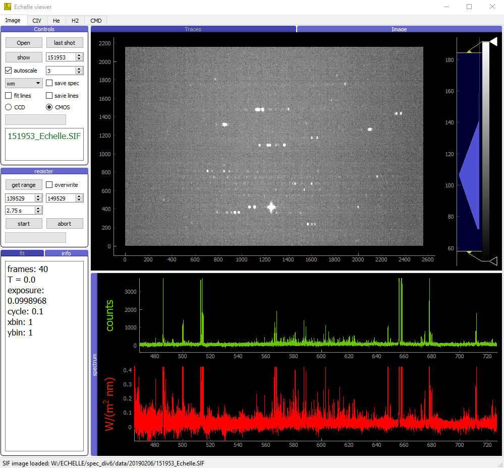

<p align="center">
  <a href="https://doi.org/10.5281/zenodo.21371984">
    
  </a>
  <a href="https://www.python.org/downloads/release/python-395">
    
  </a>
  <a href="https://github.com/queezz/echelle_spectra/blob/master/LICENSE">
    
  </a>
  <a href="https://github.com/queezz/echelle_spectra/releases/latest">
    
  </a>
</p>

<h2 align="center">
  <br>
  
  <br>
  Echelle Spectra
  <br>
</h2>

<h4 align="center">Graphical tool for the extraction and analysis of calibrated spectra from 2D Echelle spectrometer images</h4>

<p align="center">
  <a href="https://queezz.github.io/echelle_spectra">Documentation</a> •
  <a href="#quick-start">Quick Start</a> •
  <a href="#cmos-workflow">CMOS Workflow</a> •
  <a href="#venv">Venv</a>
</p>

---

## Quick Start

```bash
git clone https://github.com/queezz/echelle_spectra.git
cd echelle_spectra
pip install -e .
echelle_spectra          # launch GUI
```

See the [documentation](https://queezz.github.io/echelle_spectra) for full details.

---

## CMOS Workflow

Notebooks for the current Andor CMOS (2560×2160) setup:

```
examples/workflows/black_cmos/
├── 01_load_image.ipynb             — sanity check: load image, verify dimensions
├── 02_automated_pattern_extraction.ipynb — run packaged pattern extraction and compare traces
├── 02_pattern_calibration.ipynb    — manual/tuning reference for pattern extraction
├── 03_wavelength_calibration.ipynb — manual line ID, polynomial fit  (rare: new setup only)
├── 04_extract_spectrum.ipynb       — ROUTINE: load → calibrate → extract → save
└── 05_calibration_alignment.ipynb  — align existing wavelength table with new Ne lamp data
```

For daily use, only `04_extract_spectrum.ipynb` is needed. Historical notebooks are in `examples/obsolete/`.

The packaged pattern extraction workflow can also be run without a notebook:

```bash
echelle-pattern sphere.sif sphere-bg.sif --prior-pattern pattern_CMOS_20240305.txt
```

The packaged wavelength alignment workflow can also be run headlessly:

```bash
echelle-align \
  local/20250926_calib/Ne-0.02s-x3-bright-lines.sif \
  local/20250926_calib/Ne-0.02s-x3-bright-lines_bg.sif \
  local/20250926_calib/sphere-0.1s-x3.sif \
  local/20250926_calib/sphere-0.1s-x3-bg.sif \
  --pattern pattern_CMOS_20250926.txt
```

---

## GUI



---

## Venv

### Create virtual environment

Linux / macOS:
```bash
python3 -m venv ~/.venvs/echelle-spectra
```

Windows PowerShell:
```powershell
python -m venv "$env:USERPROFILE\.venvs\echelle-spectra"
```

### Activate virtual environment

Linux / macOS:
```bash
source ~/.venvs/echelle-spectra/bin/activate
```

Windows PowerShell:
```powershell
& "$env:USERPROFILE\.venvs\echelle-spectra\Scripts\Activate.ps1"
```

### Install

```bash
pip install -e ".[dev]"
python -m ipykernel install --user --name echelle-spectra --display-name "echelle-spectra"
```
