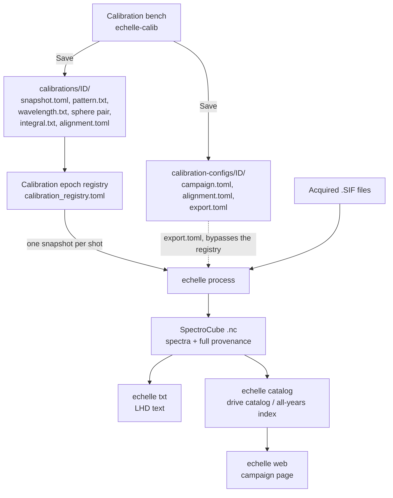

# From calibration to cube

A calibration day at the bench ends with a **Save**. A processing day ends with
cubes on a drive. This page connects the two: what Save actually leaves on disk,
which of those files a cube is built from, and where each number in a finished
cube came from.

Read it when a cube looks wrong and you need to know which calibration file to
suspect, or when you are about to process a drive and want to be sure the right
calibration will be picked up.

---

## What the bench's Save leaves behind

One bench session writes **two folders**, not one. They are siblings, they carry
the same identity (the snapshot ID, e.g. `20260814_cmos`), and they have
different jobs.

### The snapshot — `calibrations/<id>/`

This is the calibration itself: immutable, digested, and the only thing
processing ever reads.

| File | What it is |
| --- | --- |
| `snapshot.toml` | The binder. Lists every file with its role, size, and SHA-256, plus the alignment and QC record of the session that produced it. |
| `pattern.txt` | The extraction geometry — where each diffraction order sits on the detector. |
| `wavelength.txt` | The wavelength solution. **Already rigid-corrected**: the shift the bench solved is baked in at Save, so the file is the calibration the bench measured, not the table it started from. |
| `sphere.sif` + `sphere_bg.sif` | The integrating-sphere exposure and its background. |
| `integral.txt` | The sphere's own spectral reference. Together with the sphere pair, these three give the absolute-factor curve. |
| `alignment.toml` | A copy of the solved alignment, saved beside the calibration it belongs to. |

### The configuration bundle — `calibration-configs/<id>/`

Commented, hand-editable text you can open and change. Nothing here is
digested, and nothing here is read by a registry-driven run.

| File | What it is |
| --- | --- |
| `campaign.toml` | The human record of the bench session: which files got which role, which lamps, exposures, peak counts, saturated pixels. |
| `alignment.toml` | The solved shift and rotation, with every anchor line and its residual. |
| `export.toml` | A ready-to-use export configuration for this snapshot — the `--config` route below. |

!!! note "Where the two folders land"
    With no flags, both are created **inside the folder you launched the bench
    at**: `<folder>/calibrations/` and `<folder>/calibration-configs/`. Pass
    `--output-root` and `--config-root` to send them elsewhere. The bench's Save
    tab always shows both in full, so you can read where they will go before you
    press anything.

---

## The flow



---

## The normal route: through the registry

This is how a campaign drive is processed.

```bash
echelle process /data/shots -o /data/cubes \
  --registry /data/calibration_registry.toml \
  --calibrations /data/calibrations \
  --drift-verdict /data/epoch-drift.json
```

The registry is an ordered list of calibration epochs with inclusive date and
shot bounds. For every SIF, `echelle process` reads the **shot number** out of
the file's own name and the **acquisition date** out of the path components
below the source root you named, then resolves them against those bounds to
**exactly one** snapshot ID. It never falls back: two matching epochs is a
refusal, no matching epoch is a refusal, and a file that lacks the identity
needed to tell two epochs apart is a refusal too.

Once the snapshot is chosen, its files do the work:

- `pattern.txt` gives the extraction geometry;
- `wavelength.txt` gives the wavelength solution;
- `sphere.sif`, `sphere_bg.sif` and `integral.txt` give the absolute-factor
  curve applied to the counts.

A registry-backed run is also **gated**: it needs either `--sample N` (a first,
explicitly unverified sample) or `--drift-verdict` (the evidence a
`echelle drift audit` of that sample produced). See the
[calibration epoch registry](calibration-epoch-registry.md) and
[operator cheat sheet](operator-cheat-sheet.md) for the full loop.

### What the cube then remembers

Every cube written this way carries its own calibration history, so a reader
years later never has to guess:

- `snapshot_id`, and the whole `snapshot.toml` manifest verbatim;
- the **SHA-256 digest of every calibration file** used, plus the digest of the
  manifest itself — so a substituted or edited calibration file is detectable;
- `detector_pixel` — the raw, pre-flip detector column each wavelength sample
  came from — and `echelle_order`, the order it belongs to;
- the **wavelength polynomial coefficients** for each represented order. These
  are checked against the stored wavelengths before the cube is written, and a
  polynomial that does not reproduce them to within 5 × 10⁻¹⁰ nm is a refusal;
- `applied_absolute_calibration_factor` — the factor curve actually applied,
  stored alongside the spectra rather than left to be reconstructed;
- `wavelength_accuracy_nm` — how well this cube's wavelength scale is known.

!!! info "How `wavelength_accuracy_nm` is computed"
    The alignment is solved in **detector pixels**, so its RMS only becomes a
    wavelength once a dispersion is chosen. The value stored is

    `wavelength_accuracy_nm = alignment RMS (px) × median dispersion (nm/px)`

    over the orders actually present in the cube. The RMS comes from the
    manifest's `[alignment] rms_px`; for an older snapshot whose manifest
    predates that entry, the snapshot's own `alignment.toml` is the fallback.
    The drift audit reads this number so it never claims a misalignment finer
    than the calibration behind it can support.

---

## The other route: `--config`

```bash
echelle process /data/shots -o /data/cubes \
  --config /data/calibration-configs/20260814_cmos/export.toml
```

Here you name the calibration yourself instead of letting the registry choose
it. `export.toml` carries three sections:

**`[calibration]`** — names the camera and the five calibration files by role:
`order_pattern`, `wavelength`, `sphere`, `sphere_background`, `integral`
(paths relative to the config file), plus optional `calibration_dir`,
`instrument_id`, `wavelength_medium`, and `registry` / `calibrations` roots.

**`[export]`** — how the cube is written: `units`, the
`wavelength_min_nm` / `wavelength_max_nm` crop, `drop_nonfinite_columns`,
`calibration_source`, and `output_suffix`.

**`[metadata]`** — extra facts stamped onto the cube: `config_id`, the crop
notes (`crop_measurement_note`, `crop_measured_at`), and the timing the bench
does not measure — `trigger_delay_s`, `time_axis_reference`,
`frame_time_formula`, `trigger_delay_note`.

!!! important "`trigger_delay_s` is what makes LHD text possible"
    `echelle txt` writes the frozen legacy header from three timing numbers.
    Two of them, the frame interval and the exposure, come off the detector
    (`CycleTime` and `ExposureTime`) and are recorded automatically. The third,
    `trigger_delay_s`, exists **only** because `[metadata]` supplied it — the
    bench does not measure it, so each generated bundle carries the previous
    campaign's value forward and marks it as inherited. A cube without it is
    refused by `echelle txt`. Review that value before an LHD campaign rather
    than after.

!!! warning "A `--config` run is not gated"
    Naming an explicit calibration this way **bypasses the registry entirely**,
    and with the registry out of the picture the drift gate does not apply. The
    run is legal and it proceeds, but it is recorded in its receipt forever as
    `ungated (no registry)` — nothing checked that this calibration suits these
    shots. Use it for one-off or reprocessing work; use the registry for a
    campaign drive.

---

## Two files that are *not* inputs to conversion

- **`campaign.toml`** is the human record of the bench session. Conversion never
  reads it. It exists so that six months later you can see which exposure got
  which role, at what integration time, and how close to saturation.
- **`alignment.toml`** is not read for geometry either — the correction it
  describes is already inside `wavelength.txt`. Its one job in conversion is to
  supply the alignment RMS behind `wavelength_accuracy_nm`, and only when the
  manifest does not carry it.

---

## Which file did this cube's ... come from?

| If you are asking about | It came from | Which is set by |
| --- | --- | --- |
| Where the orders were cut out of the image | `pattern.txt` in the snapshot | the bench's pattern source |
| The wavelength of every point | `wavelength.txt` in the snapshot (already rigid-corrected) | the bench's alignment fit, applied at Save |
| How well the wavelengths are known | the manifest's `[alignment] rms_px` (fallback: `alignment.toml`) | the bench's alignment fit |
| The absolute intensity factors | `sphere.sif` + `sphere_bg.sif` + `integral.txt` in the snapshot | the sphere exposures of that bench session |
| Which snapshot was used at all | the epoch registry, from the shot's date and number | your registry entries — or `--config`, which skips this |
| The wavelength crop and the units | `[export]` in `export.toml` | edited by hand in the config bundle |
| The LHD text timing (`trigger_delay_s`, frame times) | `[metadata]` in `export.toml` | carried forward from the previous campaign; **review it** |
| Which lamps and exposures produced the calibration | `campaign.toml` (record only) | the bench session |

---

## See also

- [Live calibration bench](calibration-bench.md) — the calibration day itself.
- [Calibration snapshots](calibration-snapshots.md) — the snapshot format and
  its validator.
- [Calibration epoch registry](calibration-epoch-registry.md) — writing and
  checking the registry.
- [Exporting to SpectroCube](spectrocube-export.md) — the cube format in detail.
