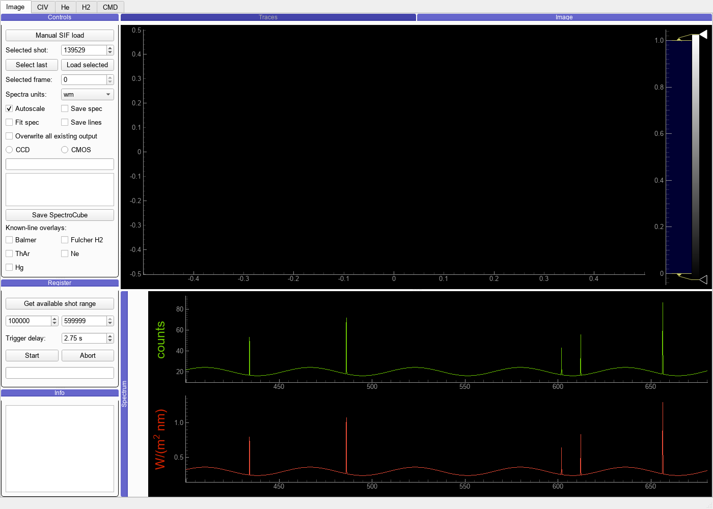
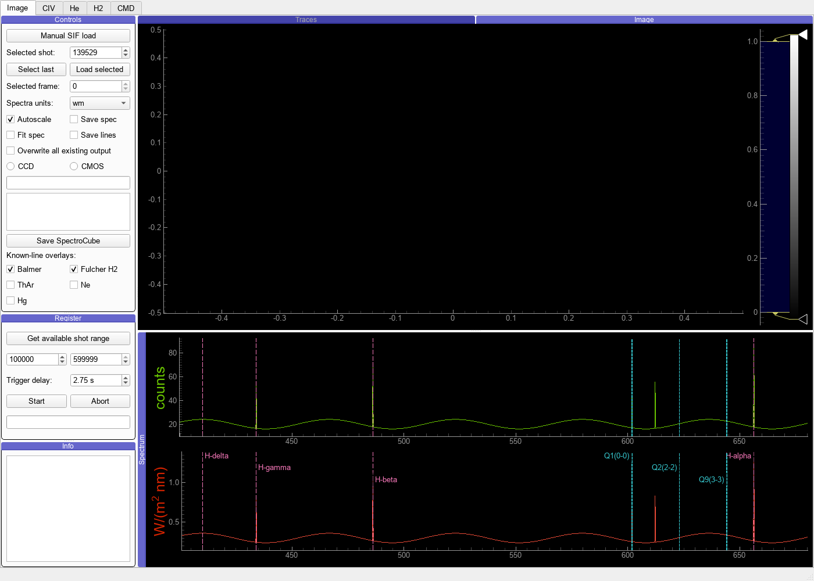
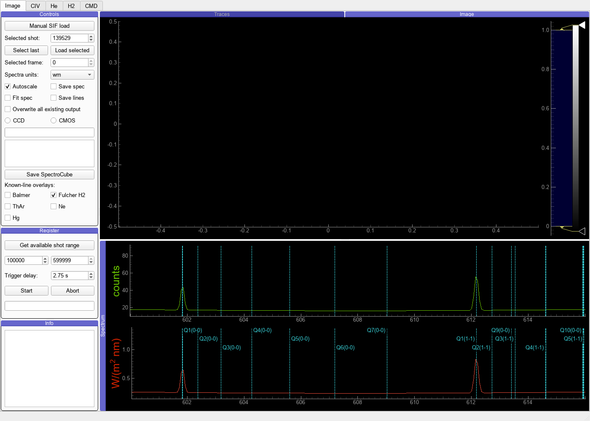
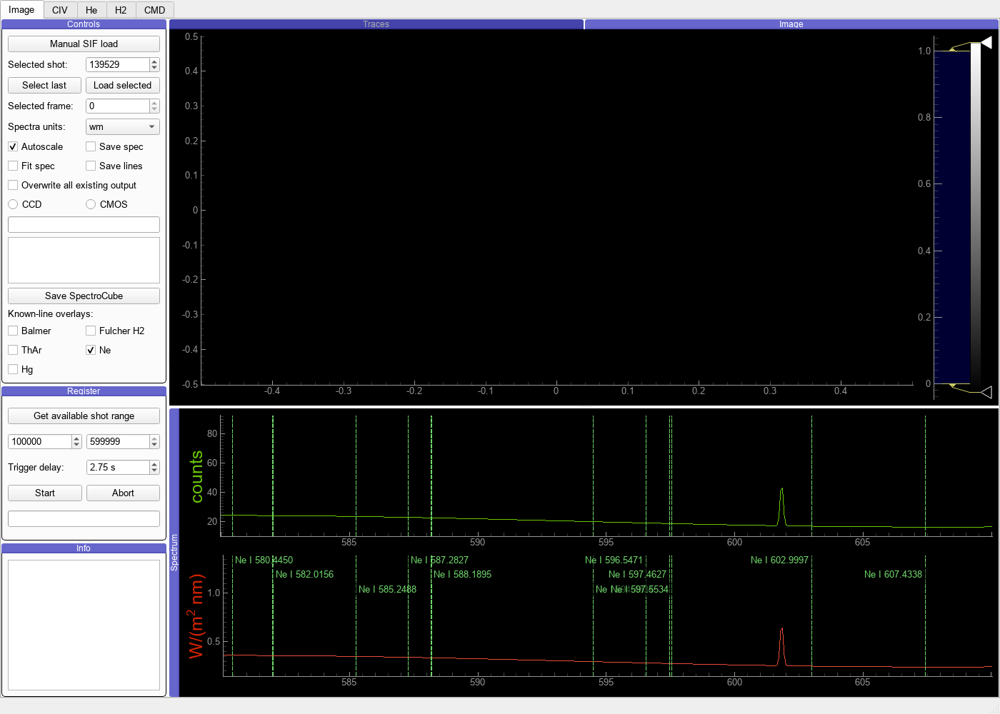

# Known-Line Tables and GUI Overlays

Echelle Spectra carries one shared API for the known lines used by the existing
GUI and by future calibration-bench tools. The public families are `balmer`,
`fulcher`, `thar`, `ne`, and `hg`.

```python
from echelle_spectra import load_line_table

for line in load_line_table("fulcher"):
    print(line.label, line.wavelength_nm, line.source_reference)
```

Every `SpectralLine` records its family, label, air wavelength, species, source
name and reference, bundled resource, optional relative intensity, and notes.
Callers can use `filter_line_table()` to select a wavelength or intensity range
without losing those provenance fields.

## Sources and conventions

| family | bundled knowledge | provenance and convention |
| --- | --- | --- |
| Balmer | H-alpha through H-delta | Established Echelle air-wavelength validation values, shared with `emissiondata` and `echelle-validate-lines`. |
| Fulcher H2 | 42 Q-branch lines in 0-0 through 3-3 | Numerically copied from the Fulcher Extractor resource archived at [Zenodo](https://doi.org/10.5281/zenodo.21372039). That resource traces the values to its early manual-extraction table but does not identify a primary publication. Echelle interprets them as air wavelengths to preserve its accepted validation convention. |
| ThAr, Ne, Hg | Atomic and ionic lamp lines | Package-cached exports from the [NIST Atomic Spectra Database](https://physics.nist.gov/asd). Observed air wavelengths are preferred, with Ritz air values used when no observation is present. Relative intensity is normalized within each spectrum in the existing loader. |

The Fulcher table is deliberately a position/identification aid. Molecular
deblending, intensity extraction, and population analysis remain in the Fulcher
packages.

## GUI use

The Image tab's Controls dock has five independent checkboxes under
**Known-line overlays**. All start unchecked, so ordinary viewing is unchanged.
Enabling a family draws color-coded vertical markers on both main spectrum
plots and compact labels on the calibrated plot.

The renderer follows the visible wavelength range:

- broad views retain only labels that have enough horizontal room;
- zooming reveals the local molecular structure and progressively weaker NIST
  rows;
- disabling a family removes every marker immediately;
- pan and zoom never alter the selected families.

The screenshots below use a synthetic spectrum solely to make the UI states
and marker behavior reproducible; they are not physics-validation evidence.

Disabled normal use stays visually identical to the established spectrum view:



A broad Balmer/Fulcher view keeps only labels that have enough room:



Zooming exposes the local line structure:





The NIST caches currently cover roughly `578–640 nm`; their lamp overlays are
therefore empty outside that packaged interval. Balmer and Fulcher tables cover
their own listed wavelengths.

## Relationship to line validation

`echelle-validate-lines` now reads the same bundled Balmer and Fulcher records
as the GUI. An external legacy Fulcher matrix can still be supplied with
`--fulcher-table`, but no sibling checkout is required for the default command.
